## Paso 0: Entorno de Trabajo

{ width=550px }

1. ¿Para qué sirve ​Valgrind​ ? ¿Cuáles son sus opciones más comunes?

Valgrind es una herramienta diseñada para detectar errores de memoria en un programa ejecutable y debugging en general. Algunos ejemplos de estos errores de memoria son la no liberación de memoria alocada en el heap (un `malloc` sin un `free`, que es una perdida de memoria o memory leak), el intento de escritura sobre un arreglo dinámico pasado su tamaño, la multiple liberación de punteros y demás.

Las opciones más comunes en su utilización son `--leak-check=full` (para detallar cada perdida de memoria), `--track-origins=yes` (encuentra el origen de las variables no inicializadas) y `--show-reachable=yes` (destalla la los bloques de memoria todavía alcanzables).

2. ¿Qué representa ​` sizeof()`​ ? ¿Cuál sería el valor de salida de `sizeof(char)`​ y ​ `sizeof(int)​`?

El operador `sizeof` de C y C++ devuelve el tamaño de distintas variables y tipos del lenguaje, utilizando como unidad el tamaño de un `char` (esto es, un byte, que se define como la cantidad de bits necesaria para almacenar un caracter). Por lo tanto, por ser la unidad, `sizeof(char)` siempre devolverá 1, es decir que un `char` siempre será de un byte (por definición), lo cual no significa que siempre sera de 8 bits, porque no en todas las arquitecturas es un byte un octeto de bits (por ejemplo, en arquitecturas más antiguas los bytes son de 16 bits).

El valor de `sizeof(int)` no es un valor garantizado como el del caracter, este depende de la arquitectura de la plataforma en donde se esta ejecutando el programa. En arquitecturas de 32 o 64 bits (`x86`, `x86_64`) un entero ocupara 32 bits, es decir, 4 bytes siendo un byte un octeto (entonces `sizeof(int)` devolverá 4), pero por ejemplo en entorno Arduino (al menos en Arduino Uno), un entero será de 16 bits (2 bytes).

3. ¿El ​`sizeof()`​ de una struct de C es igual a la suma del `sizeof()` ​ de cada uno sus elementos? Justifique mediante un ejemplo

No, esta mal asumir que una estructura será la sumatoria de sus miembros, porque se esta ignorando el concepto de alineamiento y padding. En la etapa de compilación, el compilador decidirá (a menos que se le indique lo contrario con algún atributo) como almacenar los bytes de cada variable especificada, y en el caso de una estructura, podrá optar por dejar los miembros de la estructura alineados a n bytes, siendo n el tamaño de una 'palabra' (*word*) de la arquitectura (en arquitecturas de 32 bits una palabra ocupa 32 bits, en una de 64 ocupará 64, y así). Esto lo hace para tener mas rápido acceso a cada miembro, ya que la CPU lee cada n bytes, encontrarlos alineados al tamaño de una palabra dará performance, a cambio de espacio desperdiciado (si estoy en una arquitectura de 32 bits y solo consumo 8 con un caracter, los siguientes 24 tendrán que ser llenados con padding).

```C
➜  7542-Taller/TP0 master ✗ cat struct.c 
#include <stdio.h>

struct S {
	char a;
	int b;
};

int main(){
  printf("char: %zd, int: %zd, struct S: %zd \n", 
        sizeof(char), sizeof(int), sizeof(struct S));
  return 0;
}
➜  7542-Taller/TP0 master ✗ gcc struct.c -o struct   
➜  7542-Taller/TP0 master ✗ ./struct           
char: 1, int: 4, struct S: 8 
```

4. Investigar la existencia de los archivos estándar: `STDIN`, `STDOUT`, `STDERR`. Explicar brevemente su uso y cómo redirigirlos en caso de ser necesario (caracteres `>`​ y ​ `<` ​ ) y como conectar la salida estándar de un proceso a la entrada estándar de otro con un pipe​ (carácter `|`​ ).

Los flujos estándares de Linux de input/output son `stdin`, `stdout` y `stderr`. Estos se refieren a la entrada estandar, la salida estandar, y el flujo de errores. Todo programa en ejecución de UNIX tiene estos flujos abiertos, y para manipular y utilizar su contenido, en un programa en C o C++, se pueden tratar simplemente como archivos (`FILE`) abiertos. Estos flujos usualmente refieren al teclado (entrada) y al monitor o terminal (salida y salida de errores), a menos que estos se redirijan.

Los operadores de redirección son `<`, `>` y `|`, y se usan para cuando queremos utilizar algun otro dispositivo como entrada/salida. Por ejemplo, de querer que la salida (la usual, no de errores) de un programa vaya a parar a un archivo, en vez de a la terminal, se puede utilizar algo como `./miprograma > misalida.txt`. De querer que también se incluya la salida de errores, se puede utilizar `&>`. En cambio, de querer que un programa reciba como entrada estandar un archivo, simplemente hay que hacer `./miprograma < mientrada.txt`. Finalmente, de querer que la salida de un programa se convierta en la entrada de otro, se puede utilizar un pipe, por ejemplo `echo 'hola mundo' | cat` (acá, la salida de `echo` es 'hola mundo', y se utiliza como entrada para `cat`, el cual imprime por pantalla lo que recibe por entrada estandar, es decir, nuevamente, 'hola mundo').

## Paso 1: SERCOM - Errores de generación y normas de programación

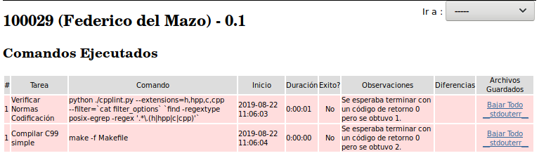{ width=550px }

Los problemas de estilo encontrados son los siguientes (en celeste, los comentarios explicando cada uno de ellos): 

```bash
./paso1_wordscounter.c:27:  Missing space before ( in while(  [whitespace/parens] [5] #aaaa
./paso1_wordscounter.c:41:  Mismatching spaces inside () in if  [whitespace/parens] [5]
./paso1_wordscounter.c:41:  Should have zero or one spaces inside ( and ) in if  [whitespace/parens] [5]
./paso1_wordscounter.c:47:  An else should appear on the same line as the preceding }  [whitespace/newline] [4]
./paso1_wordscounter.c:47:  If an else has a brace on one side, it should have it on both  [readability/braces] [5]
./paso1_wordscounter.c:48:  Missing space before ( in if(  [whitespace/parens] [5]
./paso1_wordscounter.c:53:  Extra space before last semicolon. If this should be an empty statement, use {} instead.  [whitespace/semicolon] [5]
Done processing ./paso1_wordscounter.c
./paso1_main.c:12:  Almost always, snprintf is better than strcpy  [runtime/printf] [4]
./paso1_main.c:15:  An else should appear on the same line as the preceding }  [whitespace/newline] [4]
./paso1_main.c:15:  If an else has a brace on one side, it should have it on both  [readability/braces] [5]
Done processing ./paso1_main.c
./paso1_wordscounter.h:5:  Lines should be <= 80 characters long  [whitespace/line_length] [2]
Done processing ./paso1_wordscounter.h
Total errors found: 11
```

CODIGO

```
  CC  paso1_main.o
paso1_main.c: In function 'main':
paso1_main.c:22:9: error: unknown type name 'wordscounter_t'
         wordscounter_t counter;
         ^
paso1_main.c:23:9: error: implicit declaration of function 'wordscounter_create' [-Wimplicit-function-declaration]
         wordscounter_create(&counter);
         ^
paso1_main.c:24:9: error: implicit declaration of function 'wordscounter_process' [-Wimplicit-function-declaration]
         wordscounter_process(&counter, input);
         ^
paso1_main.c:25:24: error: implicit declaration of function 'wordscounter_get_words' [-Wimplicit-function-declaration]
         size_t words = wordscounter_get_words(&counter);
                        ^
paso1_main.c:27:9: error: implicit declaration of function 'wordscounter_destroy' [-Wimplicit-function-declaration]
         wordscounter_destroy(&counter);
         ^
<builtin>: recipe for target 'paso1_main.o' failed
make: *** [paso1_main.o] Error 1
```

## Paso 2: SERCOM - Errores de generación 2

{ width=550px }

a. Describa ​ en breves palabras​ las correcciones realizadas respecto de la versión anterior.

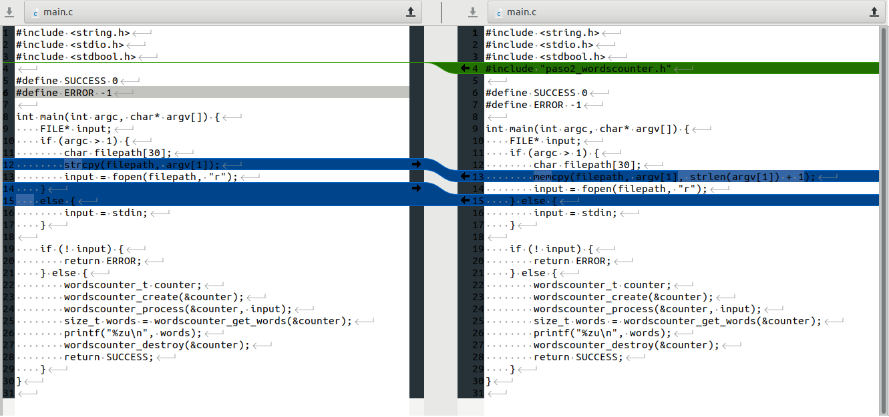{ width=550px }

Estilo: 

Done processing ./paso2_main.c
Done processing ./paso2_wordscounter.c
Done processing ./paso2_wordscounter.h
Total errors found: 0

CODIGO

  CC  paso2_wordscounter.o
In file included from paso2_wordscounter.c:1:0:
paso2_wordscounter.h:7:5: error: unknown type name 'size_t'
     size_t words;
     ^
paso2_wordscounter.h:20:1: error: unknown type name 'size_t'
 size_t wordscounter_get_words(wordscounter_t *self);
 ^
paso2_wordscounter.h:25:49: error: unknown type name 'FILE'
 void wordscounter_process(wordscounter_t *self, FILE *text_file);
                                                 ^
paso2_wordscounter.c:17:8: error: conflicting types for 'wordscounter_get_words'
 size_t wordscounter_get_words(wordscounter_t *self) {
        ^
In file included from paso2_wordscounter.c:1:0:
paso2_wordscounter.h:20:8: note: previous declaration of 'wordscounter_get_words' was here
 size_t wordscounter_get_words(wordscounter_t *self);
        ^
paso2_wordscounter.c: In function 'wordscounter_next_state':
paso2_wordscounter.c:30:25: error: implicit declaration of function 'malloc' [-Wimplicit-function-declaration]
     char* delim_words = malloc(7 * sizeof(char));
                         ^
paso2_wordscounter.c:30:25: error: incompatible implicit declaration of built-in function 'malloc' [-Werror]
paso2_wordscounter.c:30:25: note: include '<stdlib.h>' or provide a declaration of 'malloc'
cc1: all warnings being treated as errors
<builtin>: recipe for target 'paso2_wordscounter.o' failed
make: *** [paso2_wordscounter.o] Error 1


## Paso 3: SERCOM - Errores de generación 3

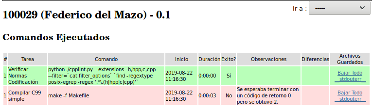{ width=550px }


  CC  paso3_wordscounter.o
  CC  paso3_main.o
  LD  tp
paso3_main.o: In function `main':
/home/sercom_backend/build/paso3_main.c:27: undefined reference to `wordscounter_destroy'
collect2: error: ld returned 1 exit status
Makefile:141: recipe for target 'tp' failed
make: *** [tp] Error 1

## Paso 4: SERCOM - ​ Memory Leaks y ​ Buffer Overflows

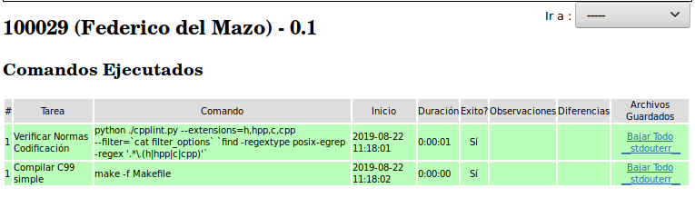{ width=550px }

Pruebas | 
- | -
{ width=300px } | 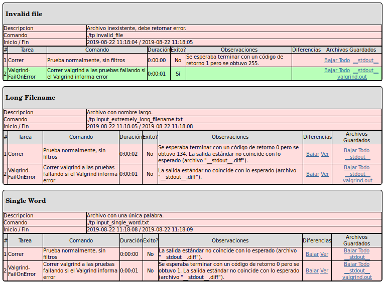{ width=300px }

==00:00:00:00.000 549== Memcheck, a memory error detector
==00:00:00:00.000 549== Copyright (C) 2002-2015, and GNU GPL'd, by Julian Seward et al.
==00:00:00:00.000 549== Using Valgrind-3.11.0 and LibVEX; rerun with -h for copyright info
==00:00:00:00.000 549== Command: ./tp input_tda.txt
==00:00:00:00.000 549== Parent PID: 548
==00:00:00:00.000 549== 
==00:00:00:00.567 549== 
==00:00:00:00.567 549== FILE DESCRIPTORS: 3 open at exit.
==00:00:00:00.567 549== Open file descriptor 2: input_tda.txt
==00:00:00:00.567 549==    at 0x4113813: __open_nocancel (syscall-template.S:84)
==00:00:00:00.567 549==    by 0x40A79BF: _IO_file_open (fileops.c:221)
==00:00:00:00.567 549==    by 0x40A7B40: _IO_file_fopen@@GLIBC_2.1 (fileops.c:328)
==00:00:00:00.567 549==    by 0x409C2D0: __fopen_internal (iofopen.c:86)
==00:00:00:00.567 549==    by 0x409C33D: fopen@@GLIBC_2.1 (iofopen.c:97)
==00:00:00:00.567 549==    by 0x8048517: main (paso4_main.c:14)
==00:00:00:00.567 549== 
==00:00:00:00.567 549== Open file descriptor 1: /mnt/data/sercom/tmp/prueba.392420.stdout
==00:00:00:00.567 549==    <inherited from parent>
==00:00:00:00.567 549== 
==00:00:00:00.567 549== Open file descriptor 0: /home/sercom_backend/test/valgrind.out
==00:00:00:00.567 549==    <inherited from parent>
==00:00:00:00.567 549== 
==00:00:00:00.567 549== 
==00:00:00:00.567 549== HEAP SUMMARY:
==00:00:00:00.567 549==     in use at exit: 1,849 bytes in 216 blocks
==00:00:00:00.567 549==   total heap usage: 218 allocs, 2 frees, 10,041 bytes allocated
==00:00:00:00.567 549== 
==00:00:00:00.568 549== 344 bytes in 1 blocks are still reachable in loss record 1 of 2
==00:00:00:00.568 549==    at 0x402D17C: malloc (in /usr/lib/valgrind/vgpreload_memcheck-x86-linux.so)
==00:00:00:00.568 549==    by 0x409C279: __fopen_internal (iofopen.c:69)
==00:00:00:00.568 549==    by 0x409C33D: fopen@@GLIBC_2.1 (iofopen.c:97)
==00:00:00:00.568 549==    by 0x8048517: main (paso4_main.c:14)
==00:00:00:00.568 549== 
==00:00:00:00.568 549== 1,505 bytes in 215 blocks are definitely lost in loss record 2 of 2
==00:00:00:00.568 549==    at 0x402D17C: malloc (in /usr/lib/valgrind/vgpreload_memcheck-x86-linux.so)
==00:00:00:00.568 549==    by 0x8048685: wordscounter_next_state (paso4_wordscounter.c:35)
==00:00:00:00.568 549==    by 0x8048755: wordscounter_process (paso4_wordscounter.c:30)
==00:00:00:00.568 549==    by 0x8048535: main (paso4_main.c:24)
==00:00:00:00.568 549== 
==00:00:00:00.568 549== LEAK SUMMARY:
==00:00:00:00.568 549==    definitely lost: 1,505 bytes in 215 blocks
==00:00:00:00.568 549==    indirectly lost: 0 bytes in 0 blocks
==00:00:00:00.568 549==      possibly lost: 0 bytes in 0 blocks
==00:00:00:00.568 549==    still reachable: 344 bytes in 1 blocks
==00:00:00:00.568 549==         suppressed: 0 bytes in 0 blocks
==00:00:00:00.568 549== 
==00:00:00:00.568 549== For counts of detected and suppressed errors, rerun with: -v
==00:00:00:00.568 549== ERROR SUMMARY: 1 errors from 1 contexts (suppressed: 0 from 0)
[SERCOM] Summary
[SERCOM] Command Line: /usr/bin/valgrind --tool=memcheck --trace-children=yes --track-fds=yes --time-stamp=yes --num-callers=20 --error-exitcode=42 --leak-check=full --leak-resolution=med --log-file=valgrind.out --show-reachable=yes --suppressions=suppressions.txt
[SERCOM] Error code configured for Valgrind: 42.
[SERCOM] Valgrind execution result: 42.
[SERCOM] Valgrind result: Failure.


==00:00:00:00.000 510== Memcheck, a memory error detector
==00:00:00:00.000 510== Copyright (C) 2002-2015, and GNU GPL'd, by Julian Seward et al.
==00:00:00:00.000 510== Using Valgrind-3.11.0 and LibVEX; rerun with -h for copyright info
==00:00:00:00.000 510== Command: ./tp input_extremely_long_filename.txt
==00:00:00:00.000 510== Parent PID: 509
==00:00:00:00.000 510== 
**00:00:00:00.547 510** *** memcpy_chk: buffer overflow detected ***: program terminated
==00:00:00:00.547 510==    at 0x402FD97: ??? (in /usr/lib/valgrind/vgpreload_memcheck-x86-linux.so)
==00:00:00:00.547 510==    by 0x40346EB: __memcpy_chk (in /usr/lib/valgrind/vgpreload_memcheck-x86-linux.so)
==00:00:00:00.547 510==    by 0x804850A: memcpy (string3.h:53)
==00:00:00:00.547 510==    by 0x804850A: main (paso4_main.c:13)
==00:00:00:00.564 510== 
==00:00:00:00.564 510== FILE DESCRIPTORS: 2 open at exit.
==00:00:00:00.564 510== Open file descriptor 1: /mnt/data/sercom/tmp/prueba.392411.stdout
==00:00:00:00.564 510==    <inherited from parent>
==00:00:00:00.564 510== 
==00:00:00:00.564 510== Open file descriptor 0: /home/sercom_backend/test/valgrind.out
==00:00:00:00.564 510==    <inherited from parent>
==00:00:00:00.564 510== 
==00:00:00:00.564 510== 
==00:00:00:00.564 510== HEAP SUMMARY:
==00:00:00:00.564 510==     in use at exit: 0 bytes in 0 blocks
==00:00:00:00.564 510==   total heap usage: 0 allocs, 0 frees, 0 bytes allocated
==00:00:00:00.564 510== 
==00:00:00:00.564 510== All heap blocks were freed -- no leaks are possible
==00:00:00:00.564 510== 
==00:00:00:00.564 510== For counts of detected and suppressed errors, rerun with: -v
==00:00:00:00.564 510== ERROR SUMMARY: 0 errors from 0 contexts (suppressed: 0 from 0)
[SERCOM] Summary
[SERCOM] Command Line: /usr/bin/valgrind --tool=memcheck --trace-children=yes --track-fds=yes --time-stamp=yes --num-callers=20 --error-exitcode=42 --leak-check=full --leak-resolution=med --log-file=valgrind.out --show-reachable=yes --suppressions=suppressions.txt
[SERCOM] Error code configured for Valgrind: 42.
[SERCOM] Valgrind execution result: 1.
[SERCOM] Valgrind result: Success.

## Paso 5: SERCOM - Código de retorno y salida estándar

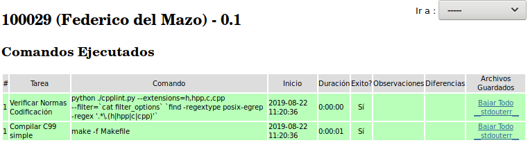{ width=550px }

Pruebas | 
- | -
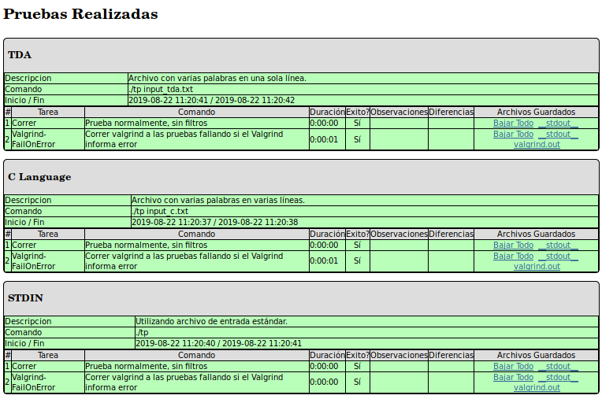{ width=300px } | 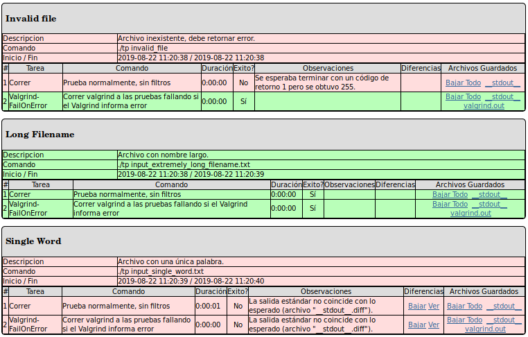{ width=300px }


## Paso 6: SERCOM - Entrega exitosa

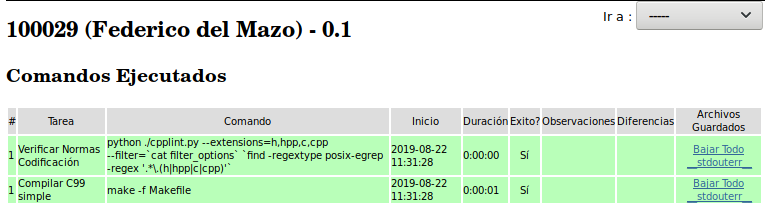{ width=550px }

Pruebas | 
- | -
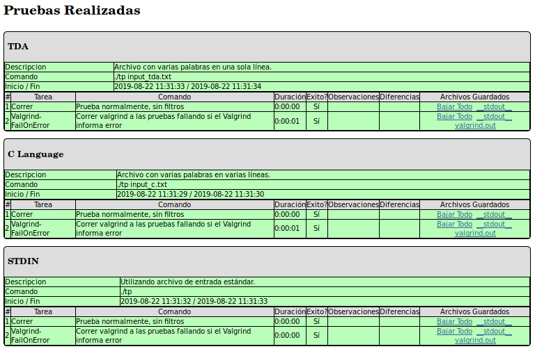{ width=300px } | 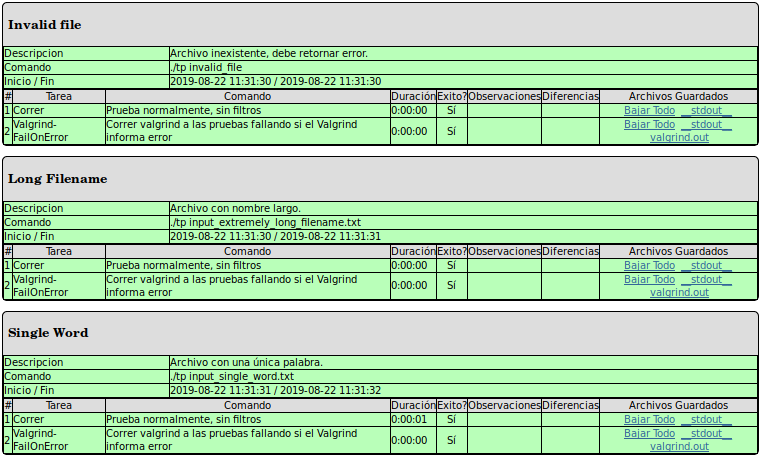{ width=300px }

## Paso 7: SERCOM - Revisión de la entrega

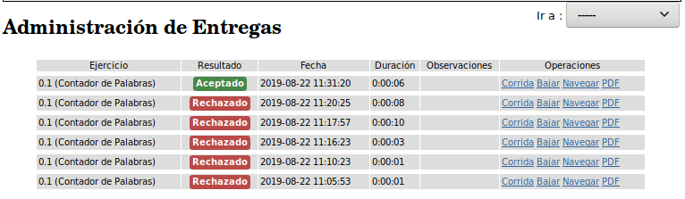{ width=550px }