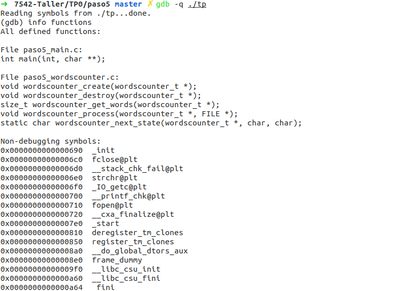
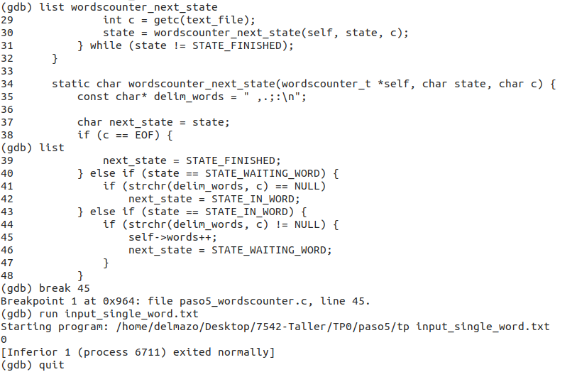
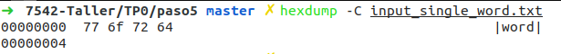

## Paso 0: Entorno de Trabajo

{ width=550px }

1. ¿Para qué sirve **​Valgrind​**? ¿Cuáles son sus opciones más comunes?

Valgrind es una herramienta diseñada para detectar errores de memoria en un programa ejecutable y debugging en general. Algunos ejemplos de estos errores de memoria son la no liberación de memoria alocada en el heap (un `malloc` sin un `free`, que es una perdida de memoria o memory leak), el intento de escritura sobre un arreglo dinámico pasado su tamaño, la múltiple liberación de punteros y demás.

Las opciones más comunes en su utilización son `--leak-check=full` (para detallar cada perdida de memoria), `--track-origins=yes` (que encuentra el origen de las variables no inicializadas) y `--show-reachable=yes` (que detalla los bloques de memoria todavía alcanzables).

2. ¿Qué representa ​` sizeof()`​? ¿Cuál sería el valor de salida de `sizeof(char)`​ y ​`sizeof(int)​`?

El operador `sizeof` de C y C++ devuelve el tamaño de distintas variables y tipos del lenguaje, utilizando como unidad el tamaño de un `char` (esto es, un byte, ya que por definición un byte es la cantidad de bits necesaria para almacenar un caracter). Por lo tanto, por ser la unidad, `sizeof(char)` siempre devolverá 1, es decir que un `char` siempre será de un byte, lo cual no significa que siempre sera de 8 bits, porque no en todas las arquitecturas es un byte un octeto de bits (por ejemplo, en arquitecturas más antiguas los bytes son de 16 bits).

El valor de `sizeof(int)` no es un valor garantizado como el del caracter, este depende de la plataforma en donde se esta ejecutando el programa. En arquitecturas de 32 o 64 bits (`x86`, `x86_64`) un entero ocupara 32 bits, es decir, 4 bytes (de 8 bits cada uno), y `sizeof(int)` devolverá 4, pero por ejemplo en entorno un Arduino (al menos en Arduino Uno), un entero será de 16 bits (2 bytes).

3. ¿El ​`sizeof()`​ de una struct de C es igual a la suma del `sizeof()`  de cada uno sus elementos? Justifique mediante un ejemplo

No, esta mal asumir que una estructura será la sumatoria de sus miembros, porque se esta ignorando el concepto de alineamiento y padding. En la etapa de compilación, el compilador decidirá (a menos que se le indique lo contrario con algún atributo) como almacenar los bytes de cada variable especificada, y podrá optar por dejar las variables espaciadas y alineadas a n bytes, siendo n el tamaño de una 'palabra' (*word*) de la plataforma (en arquitecturas de 32 bits una palabra ocupa 32 bits, en una de 64 ocupará 64, y así). Esto lo hace para tener más rápido acceso a cada miembro, ya que la CPU lee cada n bytes, encontrarlos alineados al tamaño de una palabra dará performance, a cambio de espacio desperdiciado (si estoy en una arquitectura de 32 bits y solo consumo 8 con un caracter, los siguientes 24 tendrán que ser llenados con padding).

Un ejemplo del tamaño de una estructura con un caracter y un entero, donde la sumatoria de estos no equivale a la estructura:

```C
➜  7542-Taller/TP0 master ✗ cat struct.c 
#include <stdio.h>

struct S {
	char a;
	int b;
};

int main(){
  printf("char: %zd, int: %zd, struct S: %zd \n", 
        sizeof(char), sizeof(int), sizeof(struct S));
  return 0;
}
➜  7542-Taller/TP0 master ✗ gcc struct.c -o struct   
➜  7542-Taller/TP0 master ✗ ./struct           
char: 1, int: 4, struct S: 8
```

4. Investigar la existencia de los archivos estándar: `STDIN`, `STDOUT`, `STDERR`. Explicar brevemente su uso y cómo redirigirlos en caso de ser necesario (caracteres `>`​ y ​`<`​) y como conectar la salida estándar de un proceso a la entrada estándar de otro con un pipe​ (carácter `|`​).

Los flujos estándares de Linux de input/output son `stdin`, `stdout` y `stderr`. Estos se refieren a la entrada estándar, la salida estándar, y el flujo de errores. Estos flujos usualmente refieren al teclado (entrada) y al monitor o terminal (salida y salida de errores), a menos que estos se redirijan. Todo programa en ejecución de UNIX tiene estos flujos abiertos, y para manipular y utilizar su contenido en un programa en C o C++, se pueden tratar simplemente como archivos (`FILE`) abiertos.

Algunos operadores de redirección son `<`, `>` y `|`, y se usan para cuando queremos utilizar algún otro dispositivo como entrada/salida. Por ejemplo, de querer que la salida (la usual, no de errores) de un programa vaya a parar a un archivo, en vez de a la terminal, se puede utilizar algo como `./miprograma > misalida.txt`. De querer que también se incluya la salida de errores, se puede utilizar `&>`. En cambio, de querer que un programa reciba como entrada estandar un archivo, simplemente hay que hacer `./miprograma < mientrada.txt`. Finalmente, de querer que la salida de un programa se convierta en la entrada de otro, se puede utilizar un pipe, por ejemplo: `echo 'hola mundo' | cat` (acá, la salida de `echo` es 'hola mundo', y se utiliza como entrada para `cat`, el cual imprime por pantalla lo que recibe por entrada estándar, es decir, nuevamente, 'hola mundo').

## Paso 1: SERCOM - Errores de generación y normas de programación

{ width=550px }

Los problemas de estilo encontrados son los siguientes (en celeste, los comentarios explicando cada uno de ellos): 

```bash
./paso1_wordscounter.c:27:  Missing space before ( in while(  [whitespace/parens] [5] # Hay que espaciar correctamente los if/while/for con sus paréntesis
./paso1_wordscounter.c:41:  Mismatching spaces inside () in if  [whitespace/parens] [5] # Los paréntesis deben tener espacios sincronicos
./paso1_wordscounter.c:41:  Should have zero or one spaces inside ( and ) in if  [whitespace/parens] [5] # o (algo) o ( algo )
./paso1_wordscounter.c:47:  An else should appear on the same line as the preceding }  [whitespace/newline] [4] # Despues de cerrar el bloque condicional con la llave, en esa linea debe estar la siguiente rama posible
./paso1_wordscounter.c:47:  If an else has a brace on one side, it should have it on both  [readability/braces] [5] # } else if {
./paso1_wordscounter.c:48:  Missing space before ( in if(  [whitespace/parens] [5] # idem error 1
./paso1_wordscounter.c:53:  Extra space before last semicolon. If this should be an empty statement, use {} instead.  [whitespace/semicolon] [5] # No espaciar previo a los ;
Done processing ./paso1_wordscounter.c 
./paso1_main.c:12:  Almost always, snprintf is better than strcpy  [runtime/printf] [4] # strcpy no es una función segura (no sabe cuando dejar de leer), conviene usar strncpy (o snprintf)
./paso1_main.c:15:  An else should appear on the same line as the preceding }  [whitespace/newline] [4] # idem error 4
./paso1_main.c:15:  If an else has a brace on one side, it should have it on both  [readability/braces] [5] # idem error 5
Done processing ./paso1_main.c
./paso1_wordscounter.h:5:  Lines should be <= 80 characters long  [whitespace/line_length] [2] # Mantener lineas con menos de 80 caracteres! (como las terminales originales, de 80x24, y también como el PEP8 indica para Python)
Done processing ./paso1_wordscounter.h
Total errors found: 11
```

Los errores en la generación del ejecutable son:

```bash
  CC  paso1_main.o
paso1_main.c: In function 'main':
paso1_main.c:22:9: error: unknown type name 'wordscounter_t'
         wordscounter_t counter;
         ^
paso1_main.c:23:9: error: implicit declaration of function 'wordscounter_create' [-Wimplicit-function-declaration]
         wordscounter_create(&counter);
         ^
paso1_main.c:24:9: error: implicit declaration of function 'wordscounter_process' [-Wimplicit-function-declaration]
         wordscounter_process(&counter, input);
         ^
paso1_main.c:25:24: error: implicit declaration of function 'wordscounter_get_words' [-Wimplicit-function-declaration]
         size_t words = wordscounter_get_words(&counter);
                        ^
paso1_main.c:27:9: error: implicit declaration of function 'wordscounter_destroy' [-Wimplicit-function-declaration]
         wordscounter_destroy(&counter);
         ^
<builtin>: recipe for target 'paso1_main.o' failed
make: *** [paso1_main.o] Error 1
```

**Todos los errores refieren a que nunca se incluyo la cabecera que define la estructura y las funciones _wordscounter_**. Son todos errores de compilación del `main`, nunca se llega ni a compilar el objeto de `wordscounter`, ni a enlazarlos para crear el ejecutable. No se ve ningún warning por el uso de la opción de compilación `-Werror`, la cual dice que se trate a todo tipo de warning como un error.

## Paso 2: SERCOM - Errores de generación 2

Utilizando *Meld* se pueden ver las diferencias entre los archivos entre entrega y entrega. Estas diferencias son, entre otras:

* Se incluye la cabecera de `wordscounter` en `main`
* Se cambia la llamada insegura a `strcpy` (por `memcpy`, segura)
* Se arreglan los errores de estilos, como la posición de las llaves y los espacios previos y posteriores a paréntesis, sentencias de flujo de control, puntos y coma, y demás.
* Se mejora la documentación de la estructura `wordscounters_t`

{ width=550px }

{ width=550px }

No hay errores de estilo:

```bash
Done processing ./paso2_main.c
Done processing ./paso2_wordscounter.c
Done processing ./paso2_wordscounter.h
Total errors found: 0
```

La generación del binario tuvo los siguientes errores (los comentarios son del alumno):

```bash
  CC  paso2_wordscounter.o
In file included from paso2_wordscounter.c:1:0:
# La cabecera de wordscounter no incluye archivos de la biblioteca estandar, donde se definen los tipos size_t y FILE
paso2_wordscounter.h:7:5: error: unknown type name 'size_t'
     size_t words;
     ^
paso2_wordscounter.h:20:1: error: unknown type name 'size_t'
 size_t wordscounter_get_words(wordscounter_t *self);
 ^
paso2_wordscounter.h:25:49: error: unknown type name 'FILE'
 void wordscounter_process(wordscounter_t *self, FILE *text_file);
                                                 ^
# Los errores anteriores llevan a un domino de errores donde se malentienden los tipos entre la cabecera y el archivo fuente, aunque la definición (en archivo fuente) y la declaración (en la cabecera) esten correctas e iguales.
paso2_wordscounter.c:17:8: error: conflicting types for 'wordscounter_get_words'
 size_t wordscounter_get_words(wordscounter_t *self) {
        ^
In file included from paso2_wordscounter.c:1:0:
paso2_wordscounter.h:20:8: note: previous declaration of 'wordscounter_get_words' was here
 size_t wordscounter_get_words(wordscounter_t *self);
        ^
# Se debe incluir stdlib, no solo stdio, para encontrar la definición de malloc (como bien indica el compilador)
paso2_wordscounter.c: In function 'wordscounter_next_state':
paso2_wordscounter.c:30:25: error: implicit declaration of function 'malloc' [-Wimplicit-function-declaration]
     char* delim_words = malloc(7 * sizeof(char));
                         ^
paso2_wordscounter.c:30:25: error: incompatible implicit declaration of built-in function 'malloc' [-Werror]
paso2_wordscounter.c:30:25: note: include '<stdlib.h>' or provide a declaration of 'malloc'
cc1: all warnings being treated as errors
<builtin>: recipe for target 'paso2_wordscounter.o' failed
make: *** [paso2_wordscounter.o] Error 1

# Nuevamente, no se llega a la etapa de enlazamiento, todos los errores son de compilación.
```

## Paso 3: SERCOM - Errores de generación 3

Los cambios de esta entrega fueron incluir las bibliotecas faltantes.

{ width=550px }

El único error en la generación del ejecutable es el siguiente:

```bash
  CC  paso3_wordscounter.o
  CC  paso3_main.o
  LD  tp
paso3_main.o: In function `main':
/home/sercom_backend/build/paso3_main.c:27: undefined reference to `wordscounter_destroy'
collect2: error: ld returned 1 exit status
Makefile:141: recipe for target 'tp' failed
make: *** [tp] Error 1
```

Este es un error de enlazamiento (nótese que se llegan a compilar los objetos `wordscounter` y `main`, y que falla recién en el comando `LD`), y solo refiere a que `wordscounter_destroy` nunca fue definida (pero si declarada), por ende `main` no puede utilizar la función de `wordscounter`, y solo falla una vez que se pide que interactúen estos dos archivos entre si (es decir, en el enlace).

## Paso 4: SERCOM - ​ Memory Leaks y ​ Buffer Overflows

El único cambio en esta entrega fue la definición (vacía) de `wordscounter_destroy`, para finalmente lograr la correcta generación del ejecutable. 

{ width=550px }

Pruebas de la cuarta entrega| 
- | -
{ width=300px } | { width=300px }

Por más que haya una correcta ejecución, la corrida con Valgrind no es exitosa. Esto se puede ver en las siguientes dos pruebas.

```bash
# Prueba: TDA
==00:00:00:00.000 549== Memcheck, a memory error detector
==00:00:00:00.000 549== Copyright (C) 2002-2015, and GNU GPL'd, by Julian Seward et al.
==00:00:00:00.000 549== Using Valgrind-3.11.0 and LibVEX; rerun with -h for copyright info
==00:00:00:00.000 549== Command: ./tp input_tda.txt
==00:00:00:00.000 549== Parent PID: 548
==00:00:00:00.000 549== 
==00:00:00:00.567 549== 
==00:00:00:00.567 549== FILE DESCRIPTORS: 3 open at exit.
==00:00:00:00.567 549== Open file descriptor 2: input_tda.txt
==00:00:00:00.567 549==    at 0x4113813: __open_nocancel (syscall-template.S:84)
==00:00:00:00.567 549==    by 0x40A79BF: _IO_file_open (fileops.c:221)
==00:00:00:00.567 549==    by 0x40A7B40: _IO_file_fopen@@GLIBC_2.1 (fileops.c:328)
==00:00:00:00.567 549==    by 0x409C2D0: __fopen_internal (iofopen.c:86)
==00:00:00:00.567 549==    by 0x409C33D: fopen@@GLIBC_2.1 (iofopen.c:97)
==00:00:00:00.567 549==    by 0x8048517: main (paso4_main.c:14)
==00:00:00:00.567 549== 
==00:00:00:00.567 549== Open file descriptor 1: /mnt/data/sercom/tmp/prueba.392420.stdout
==00:00:00:00.567 549==    <inherited from parent>
==00:00:00:00.567 549== 
==00:00:00:00.567 549== Open file descriptor 0: /home/sercom_backend/test/valgrind.out
==00:00:00:00.567 549==    <inherited from parent>
==00:00:00:00.567 549== 
==00:00:00:00.567 549== 
==00:00:00:00.567 549== HEAP SUMMARY:
==00:00:00:00.567 549==     in use at exit: 1,849 bytes in 216 blocks
==00:00:00:00.567 549==   total heap usage: 218 allocs, 2 frees, 10,041 bytes allocated
==00:00:00:00.567 549== 
==00:00:00:00.568 549== 344 bytes in 1 blocks are still reachable in loss record 1 of 2
==00:00:00:00.568 549==    at 0x402D17C: malloc (in /usr/lib/valgrind/vgpreload_memcheck-x86-linux.so)
==00:00:00:00.568 549==    by 0x409C279: __fopen_internal (iofopen.c:69)
==00:00:00:00.568 549==    by 0x409C33D: fopen@@GLIBC_2.1 (iofopen.c:97)
==00:00:00:00.568 549==    by 0x8048517: main (paso4_main.c:14)
==00:00:00:00.568 549== 
==00:00:00:00.568 549== 1,505 bytes in 215 blocks are definitely lost in loss record 2 of 2
==00:00:00:00.568 549==    at 0x402D17C: malloc (in /usr/lib/valgrind/vgpreload_memcheck-x86-linux.so)
==00:00:00:00.568 549==    by 0x8048685: wordscounter_next_state (paso4_wordscounter.c:35)
==00:00:00:00.568 549==    by 0x8048755: wordscounter_process (paso4_wordscounter.c:30)
==00:00:00:00.568 549==    by 0x8048535: main (paso4_main.c:24)
==00:00:00:00.568 549== 
==00:00:00:00.568 549== LEAK SUMMARY:
==00:00:00:00.568 549==    definitely lost: 1,505 bytes in 215 blocks
==00:00:00:00.568 549==    indirectly lost: 0 bytes in 0 blocks
==00:00:00:00.568 549==      possibly lost: 0 bytes in 0 blocks
==00:00:00:00.568 549==    still reachable: 344 bytes in 1 blocks
==00:00:00:00.568 549==         suppressed: 0 bytes in 0 blocks
==00:00:00:00.568 549== 
==00:00:00:00.568 549== For counts of detected and suppressed errors, rerun with: -v
==00:00:00:00.568 549== ERROR SUMMARY: 1 errors from 1 contexts (suppressed: 0 from 0)
[SERCOM] Summary
[SERCOM] Command Line: /usr/bin/valgrind --tool=memcheck --trace-children=yes --track-fds=yes --time-stamp=yes --num-callers=20 --error-exitcode=42 --leak-check=full --leak-resolution=med --log-file=valgrind.out --show-reachable=yes --suppressions=suppressions.txt
[SERCOM] Error code configured for Valgrind: 42.
[SERCOM] Valgrind execution result: 42.
[SERCOM] Valgrind result: Failure.

# Prueba: Long Filename
==00:00:00:00.000 510== Memcheck, a memory error detector
==00:00:00:00.000 510== Copyright (C) 2002-2015, and GNU GPL'd, by Julian Seward et al.
==00:00:00:00.000 510== Using Valgrind-3.11.0 and LibVEX; rerun with -h for copyright info
==00:00:00:00.000 510== Command: ./tp input_extremely_long_filename.txt
==00:00:00:00.000 510== Parent PID: 509
==00:00:00:00.000 510== 
**00:00:00:00.547 510** *** memcpy_chk: buffer overflow detected ***: program terminated
==00:00:00:00.547 510==    at 0x402FD97: ??? (in /usr/lib/valgrind/vgpreload_memcheck-x86-linux.so)
==00:00:00:00.547 510==    by 0x40346EB: __memcpy_chk (in /usr/lib/valgrind/vgpreload_memcheck-x86-linux.so)
==00:00:00:00.547 510==    by 0x804850A: memcpy (string3.h:53)
==00:00:00:00.547 510==    by 0x804850A: main (paso4_main.c:13)
==00:00:00:00.564 510== 
==00:00:00:00.564 510== FILE DESCRIPTORS: 2 open at exit.
==00:00:00:00.564 510== Open file descriptor 1: /mnt/data/sercom/tmp/prueba.392411.stdout
==00:00:00:00.564 510==    <inherited from parent>
==00:00:00:00.564 510== 
==00:00:00:00.564 510== Open file descriptor 0: /home/sercom_backend/test/valgrind.out
==00:00:00:00.564 510==    <inherited from parent>
==00:00:00:00.564 510== 
==00:00:00:00.564 510== 
==00:00:00:00.564 510== HEAP SUMMARY:
==00:00:00:00.564 510==     in use at exit: 0 bytes in 0 blocks
==00:00:00:00.564 510==   total heap usage: 0 allocs, 0 frees, 0 bytes allocated
==00:00:00:00.564 510== 
==00:00:00:00.564 510== All heap blocks were freed -- no leaks are possible
==00:00:00:00.564 510== 
==00:00:00:00.564 510== For counts of detected and suppressed errors, rerun with: -v
==00:00:00:00.564 510== ERROR SUMMARY: 0 errors from 0 contexts (suppressed: 0 from 0)
[SERCOM] Summary
[SERCOM] Command Line: /usr/bin/valgrind --tool=memcheck --trace-children=yes --track-fds=yes --time-stamp=yes --num-callers=20 --error-exitcode=42 --leak-check=full --leak-resolution=med --log-file=valgrind.out --show-reachable=yes --suppressions=suppressions.txt
[SERCOM] Error code configured for Valgrind: 42.
[SERCOM] Valgrind execution result: 1.
[SERCOM] Valgrind result: Success.
```

En ambas pruebas se olvida cerrar el archivo de entrada (cada `fopen` debería tener su respectivo `fclose`).

En la primera prueba se tienen variables dinámicas (creadas con `malloc`) sin liberar. Específicamente, la cadena de caracteres delimitadores. El uso de `strcpy`, si bien inseguro usado descuidadamente, podría haber solucionado esto, ya que las variables que no se liberaron no tienen motivo para ser dinámicas (se usan solamente en esa función, y no hay ninguna manipulación fuera de lo normal).

En la segunda prueba se encuentra un **buffer overflow**, porque se admiten archivos con nombres de hasta 30 caracteres (es un arreglo `char file_name[30]`), y la prueba intenta con un archivo con nombre aún más largo que esto.

* Un **segmentation fault** es cuando se intenta acceder a un segmento de memoria restringido. Por ejemplo, al intentar acceder al code segment (de solo lectura).
* Un **buffer overflow** es cuando se intenta escribir pasado un buffer, por ejemplo, al superar el límite de 30 caracteres y escribir el caracter número 31.

## Paso 5: SERCOM - Código de retorno y salida estándar

Los cambios de esta entrega incluyen:

* Se cambia la cadena de caracteres delimitadores (la que perdía memoria en la entrega anterior) a una en el stack.
* Se cierra el archivo de entrada

{ width=550px }

Pruebas de la quinta entrega | 
- | -
{ width=300px } | { width=300px }

Para saber específicamente el error en las pruebas, se reporta de cada una si el código de retorno es el esperado y si la salida esperada coincide con lo esperado (lo cual no sucede en dos pruebas, en su ejecución sin Valgrind).

Depurando la quinta entrega con gdb | 
- | -
{ width=300px } | { width=300px }

En la depuración se utilizaron comandos para listar todas las declaraciones, luego listar todas las lineas de la función que cambia de estado en la estructura y luego se puso un breakpoint previo a ejecutar todo. Al breakpoint no se entra nunca porque esta dentro de la condición de que un delimitador este en la palabra, pero `word` (la entrada) no tiene ningun delimitador.

{ width=550px }

## Paso 6: SERCOM - Entrega exitosa

Los cambios de esta entrega incluyen:

* Definir el error como 1 (y no -1).
* Definir los delimitadores como constantes (del preprocesador).
* Cambiar la lógica del flujo de la función `wordscounter_next_state`.

{ width=550px }

Pruebas de la sexta entrega | 
- | -
{ width=300px } | { width=300px }

{ width=550px }

## Paso 7: SERCOM - Revisión de la entrega

{ width=550px }