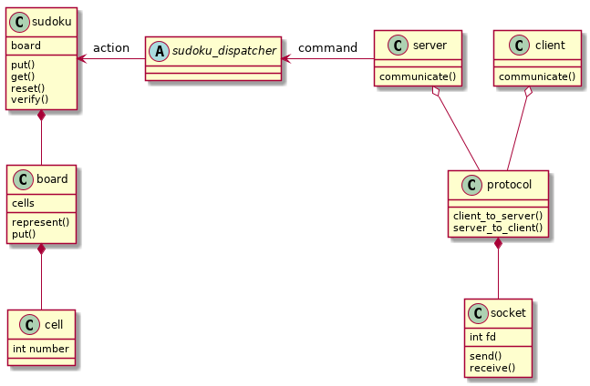
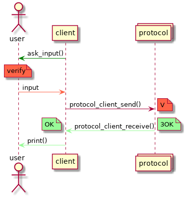
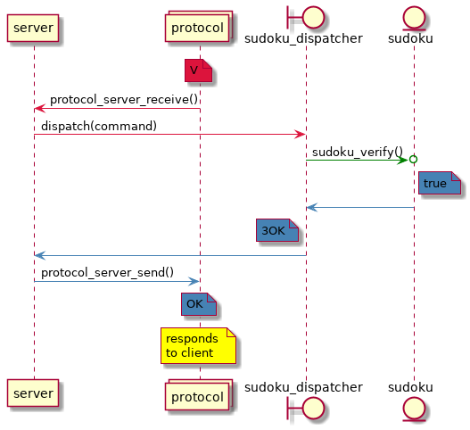

En el ejercicio se implementa un programa que actúa por un lado como cliente y por el otro como servidor. El rol del servidor será el almacenar y accionar sobre un juego de sudoku, del cual el cliente le dirá qué comandos seguir.

En el presente informe se muestran los rasgos generales del programa desarrollado, su esqueleto y algunos problemas encontrados en el desarrollo, y su subsiguiente solución.

## Diseño

El trabajo se dividió en dos módulos (casi) enteramente separados. Por un lado, está todo lo que se refiere al juego de sudoku en sí, que puede ser jugado localmente sin necesidad de ningún tipo de conectividad, y por el otro, está el componente de red, el cual se encarga de enviar los comandos desde el jugador hasta el juego.

La conexión entre estos módulos es mínima (solo una clase que se encarga de 'despachar' los comandos). De ser deseado, con pocos cambios se podría jugar a otro juego (un crucigrama) con el mismo tipo de conexión, o inversamente, podría usarse otro tipo de conexión (en vez de sockets, una RESTful API) para jugar al sudoku.

Ambos módulos fueron diseñados con un sistema de capas en mente, con cada capa siendo compuesta por una en un nivel inferior. El sudoku contiene al tablero que contiene a las celdas con los números, y el servidor/cliente contiene al protocolo que contiene al socket de comunicación.

{ width=440px }

Si bien este diagrama no está detallado a nivel implementación (por ejemplo, el protocolo discretiza entre enviar y recibir), es una vista general acerca del diseño del trabajo y los distintos roles y responsabilidades de las clases.

## Comunicación

En cuanto a la comunicación entre servidor y cliente, hay también diversas capas. Es por este diseño modular que uno podría reemplazar los distintos componentes y los niveles no llegarían a enterarse del cambio. 

Por ejemplo, el protocolo actual es el de convertir un comando como `put 5 in 1,2` en un mensaje como `P512`, y que eso se despache a la acción de colocar un número en una celda. Sin embargo, este protocolo podría cambiarse a que el mensaje sea `P125`, y solo debería cambiarse la capa del medio (el protocolo), sin que el servidor y el cliente se vean modificados.

De la misma manera, se podría reemplazar el socket por una API, y el servidor y el cliente no verían cambios desde su lado (estos no tienen noción de lo que hay por debajo del protocolo, solo se encargan de pedir comandos y dar respuestas).

Punto de vista del cliente/servidor | 
- | -
{ width=250 } | { width=350px }


Es de notar que en ninguno de estos dos diagramas (desde el punto de vista del cliente y del servidor respectivamente) se habla de sockets. Esto es porque a estos participantes (cliente/servidor) no les concierne lo que haya debajo del protocolo.

## Problemas particulares

En el desarrollo del programa, se encontraron varios problemas. Algunos, los más interesantes, se detallan a continuación.

### Representación del tablero

Siendo tan engorrosa la manera en la que se tiene que imprimir el tablero por pantalla, se terminó optando por una seguidilla de llamadas afunciones que sepan cómo imprimir distintas partes del tablero, y todas estas representaciones siendo concatenadas en el mismo buffer.

Primero, se llama a imprimir al tablero, el cual llama a la impresión de cada línea (es decir itera todas las líneas). Esta impresión de línea llama 3 veces a la impresión de cada conjunto de 3 celdas (una línea es de 9 celdas, entonces se llama a 3 impresiones de 3 celdas). Finalmente, esta impresión de celdas llama a la impresión de cada celda singular. Entonces, primero se imprimen las 3 celdas del conjunto, a este se le concatenan las celdas 4 a 6 y luego 7 a 9, y ya se tiene la primera fila, y luego se repite este proceso por cada fila.


### Verificación del tablero

Sabiendo que las reglas del sudoku se prestan a la generalización, se intentó hacer una función auxiliar que verifique el estado tanto de las filas como de las columnas como de las secciones de 9 celdas. Entonces, se tiene una función que verifica que en un conjunto de 9 celdas, sea cuales fueren, no se repitan números. Esto se hace sencillamente inicializando una lista de booleanos donde el índice representa que el número esté presente, una vez que se repite un booleano, se sabe que el número ya estaba presente y por ende el conjunto no es válido.

Para las filas y las columnas el conjunto a verificar es fácil: se iteran todas las celdas con índice `x,y`, con el `x` fijo en el caso de verificar una fila, y con el `y` fijo al verificar una columna.

Para las secciones, en cambio, se iteran 3 filas partiendo desde la división entera (`//`) del número de sección con el 3, multiplicado por 3, y se iteran 3 columnas partiendo desde el resto (`%`) de la división, tambíen multiplicado por 3. Por ejemplo, para la sección 0 (arriba a la izquierda del tablero), se iteran las filas 0 1 y 2 (siendo `(0//3) *3 == 0`) y las columnas 0 1 y 2 (`(0%3) *3 == 0`), mientras que para la sección 5 se iteran las filas 3 4 y 5 (`(5//3) *3 == 3`) y las columnas 6 7 y 9 (`(5%3) *3 == 6`)

### Red

El mayor problema encontrado en el diseño de las conexiones fue al agregarle comportamiento de validación al cliente. Al ingresar un número inválido (por ejemplo, un 0), según las especificaciones del trabajo, es el cliente quien debe imprimir un mensaje de error y nunca se debe enviar nada al servidor.

El problema con esto es que intenta romper mucho del encapsulamiento previamente planteado (e incluso desafía el diagrama presente en este informe, ya que el cliente sí debe conocer a la clase despachadora de comandos). Idealmente, el cliente solo debería encargarse de imprimir lo que el servidor le responda, sea lo que sea, y es por esto que debería poder codificarse como un módulo externo al servidor (quien sí debe conocer del juego), y funcionar solamente como un cliente que se conecta a *algo*, sin importar que tiene el servidor para contestarle (sea un juego de sudoku, o un sistema de mensajería cualquiera).

En cambio, con esta nueva funcionalidad de validar los comandos, se agrega mucho acoplamiento al sistema. Ahora, el cliente pasa a tener conocimiento del modelo detrás, y debe saber específicamente que lo que hay del otro lado de la conexión es un *sudoku*, debe saber sus reglas de juego, y debe saber que clase de comando es válido y que clase de comando no lo es.

Es por esto que la clase que despacha comandos pasa a funcionar tanto para el cliente como para el servidor, para que por un lado sepa responder si un comando será valido o no del lado del cliente (antes de enviarlo al servidor), y por el otro sepa como accionar desde el lado del servidor una vez que recibe un comando sí valido. 

Idealmente, de ser más grande el proyecto, este *handler* debería dividirse en dos, uno del cliente y uno del servidor, para poder asignarle comportamiento específico y bien modulado a ambas partes por separado. Pero como el cliente solo se encarga de imprimir lo que recibe (comportamiento no tan digno de una clase entera, porque es solo una llamada a `printf()`), y de validar comandos, se deja al `sudoku_dispatcher` con dos funciones, una que llame el cliente y una que llame al servidor, y no como dos clases distintas.

\newpage
\fancyfoot[]{}

## Cambios requeridos en la re-entrega

* Se cambian las firmas de inicialización (y otros métodos) de la clase de protocolo para que los parametros `host` y `port` sean constantes. Lo mismo sucede con el buffer del cual se quieren parsear los comandos. Esto es porque estas funciones efectivamente no cambian (ni deberían cambiar) estos parametros.

```diff
--- a/TP1/network/protocol.c
+++ b/TP1/network/protocol.c
 #include "sudoku_dispatcher.h"
 #include <arpa/inet.h>
 
-bool protocol_client_init(protocol_t *self, char *host, char *port) {
+bool protocol_client_init(protocol_t *self, const char *host, const char *port){
     bool no_err = true;
     socket_t *socket = malloc(sizeof(socket_t));
     no_err &= socket_connect(socket, host, port);
@@ -22,7 +22,7 @@ 
 
-bool protocol_server_init(protocol_t *self, char *port) {
+bool protocol_server_init(protocol_t *self, const char *port) {
     socket_t *socket = malloc(sizeof(socket_t));
     if (!socket_bind(socket, port)) return false;
     socket_listen(socket);
@@ -47,7 +47,7 @@ 
 
-static ssize_t _encode_request(char *buf, char *message) {
+static ssize_t _encode_request(const char *buf, char *message) {
     char action[MAX_LENGTH_COMMAND] = {0};
     ssize_t bytes = 0;
     sscanf(buf, "%s", action);

--- a/TP1/network/protocol.h
+++ b/TP1/network/protocol.h
@@ -24,11 +24,11 @@ 
 
 // Initializes the structure when called from the client
 // Returns false if any of the subsequent initializations fail
-bool protocol_client_init(protocol_t *self, char *host, char *port);
+bool protocol_client_init(protocol_t *self, const char *host, const char *port);
 
 // Initializes the structure when called from the client
 // Returns false if any of the subsequent initializations fail
-bool protocol_server_init(protocol_t *self, char *port);
+bool protocol_server_init(protocol_t *self, const char *port);
```

* Se modifica en el manejo de errores que el método del socket que consigue la dirección a la cual conectarse no sea la responsable de liberar el socket. De fallar la función, es tanto el método de `connect` o `bind` el encargado de entender esta salida, y ahí liberar el socket. 

```diff
--- a/TP1/network/socket.c
+++ b/TP1/network/socket.c
@@ -25,16 +25,19 @@ 


-        socket_release(self);
-        return false;
+        return NULL;
     }
     return addr_list;
 }
 
 bool socket_connect(socket_t *self, const char *host, const char *service) {
     bool connection_err = false;
-    struct addrinfo *addr_list = _get_addr(self, host,
-                                           service, CLIENT_FLAGS);
+    struct addrinfo *addr_list;
+    if ((addr_list = _get_addr(self, host, service, CLIENT_FLAGS)) == NULL) {
+        socket_release(self);
+        return false;
+    }
+
     int fd = -1;
     struct addrinfo *addr = addr_list;
@@ -58,8 +61,11 @@ 
 
 bool socket_bind(socket_t *self, const char *service) {
     bool bind_err = false;
-    struct addrinfo *addr_list = _get_addr(self, NULL,
-                                           service, SERVER_FLAGS);
+    struct addrinfo *addr_list;
+    if ((addr_list = _get_addr(self, NULL, service, SERVER_FLAGS)) == NULL) {
+        socket_release(self);
+        return false;
+    }
```

* Se cambia para que el arreglo de punteros (el que contiene las celdas) sea de 9 y no de 81 punteros (había un error en la inicialización, donde se pedía mas memoria de la necesaria). Para que esto funcione, se cambian las funciones de destrucción y liberación del arreglo (se generaba un `invalid read` porque la condición de corte del ciclo definido era `arreglo[x]`, ahora, se recorre el arreglo con un tamaño fijo).

```diff
--- a/TP1/sudoku/2d_array.c
+++ b/TP1/sudoku/2d_array.c
@@ -3,11 +3,11 @@
 
 void ***_2d_array_create(size_t n, size_t m) {
     void ***arr;
-    if (!(arr = calloc(n * m, sizeof(void *)))) return NULL;
+    if (!(arr = calloc(n, sizeof(void *)))) return NULL;
 
     for (size_t x = 0; x < n; x++) {
         if (!(arr[x] = malloc(sizeof(void *) * m))) {
-            _2d_array_destroy((void **) arr);
+            _2d_array_destroy((void **) arr, n);
             return NULL;
         }
     }
@@ -27,14 +27,14 @@ 
-void _2d_array_release(void ***arr) {
-    for (size_t x = 0; arr[x]; x++) {
-        for (size_t y = 0; arr[y]; y++) free(arr[x][y]);
+void _2d_array_release(void ***arr, size_t n, size_t m) {
+    for (size_t x = 0; x < n; x++) {
+        for (size_t y = 0; y < m; y++) free(arr[x][y]);
     }
 }
 
-void _2d_array_destroy(void **arr) {
-    for (size_t x = 0; arr[x]; x++)
+void _2d_array_destroy(void **arr, size_t n) {
+    for (size_t x = 0; x < n; x++)
         free(arr[x]);
     free(arr);
 }

--- a/TP1/sudoku/2d_array.h
+++ b/TP1/sudoku/2d_array.h
@@ -8,8 +8,8 @@ 
 
-void _2d_array_release(void ***arr);
+void _2d_array_release(void ***arr, size_t n, size_t m);
 
-void _2d_array_destroy(void **arr);
+void _2d_array_destroy(void **arr, size_t n);
 
--- a/TP1/sudoku/board.c
+++ b/TP1/sudoku/board.c
@@ -12,7 +12,7 @@ 
 
     if (!_2d_array_init((void ***) cells, sizeof(cell_t), range, range)) {
-        _2d_array_release((void ***) cells);
+        _2d_array_release((void ***) cells, range, range);
         return false;
     }
 
@@ -171,6 +171,6 @@ 
 
 void board_release(board_t *self) {
-    _2d_array_release((void ***) self->cells);
-    _2d_array_destroy((void **) self->cells);
+    _2d_array_release((void ***) self->cells, self->range, self->range);
+    _2d_array_destroy((void **) self->cells, self->range);
 }

--- a/TP1/sudoku/sudoku.c
+++ b/TP1/sudoku/sudoku.c
@@ -34,7 +34,7 @@ 
     }
 
     board_load(&self->board, numbers, SUDOKU_RANGE, SUDOKU_RANGE);
-    _2d_array_destroy((void **) numbers);
+    _2d_array_destroy((void **) numbers, SUDOKU_RANGE);
     fclose(stream);
     return true;
 }
```
