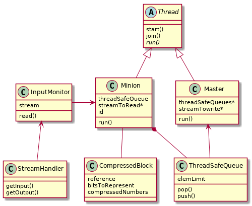

En el ejercicio se implementa un programa que busca comprimir una secuencia de números garantizada a estar ordenada localmente (los números en posiciones cercanas son similares), usando la técnica *frame of reference*. Para agilizar esta compresión, se busca trabajar de manera concurrente, haciendo que distintos hilos vayan leyendo y comprimiendo conjuntos de números del archivo, y luego otro hilo se encargue de ir escribiendo la secuencia comprimida a un nuevo archivo.

## Diseño

El diseño del programa tiene como objetivo priorizar el encapsulamiento, la modularización y la flexibilidad de éste. Es por esto que se tienen distintas entidades, cada una con su responsabilidad singular, y cada una reemplazable (por un nuevo módulo a integrar) o reutilizable (en otro programa).

Idealmente, se debería poder cambiar la técnica de compresión, o la manera en la que se leen/escriben los distintos números de la secuencia, y los cambios en entidades que no tratan con esos temas será mínimo.

{ width=440px }

## Compresión

Todo lo que respecta a la compresión de bloques de números pasa por la clase *CompressedBlock*. Esta clase tiene la responsabilidad de recibir un vector de números y almacenar en sí misma (como atributos) los distintos elementos necesarios para la compresión (por ejemplo, la referencia).

Una decisión de implementación fue en ningún momento almacenar el vector de números. Simplemente, estos números comprimidos no son necesarios de tener en ningún otro momento más allá de la construcción del bloque. No hay ninguna otra instancia del programa donde sea necesario tener una referencia a los números originales. Teniendo como objetivo tener clases compactas y mínimas, el tener una clase de bloque, ademas de la de bloque comprimido, solo agregaría ruido. 

Una vez almacenados los elementos necesarios en sí mismo, el bloque comprimido posee el método de escritura, que se puede llamar en cualquier momento de la ejecución, y es el que se encarga de escribir la secuencia comprimida en un flujo de salida.

## Concurrencia

En cuanto al *multithreading* del programa, hay dos tipos distintos de hilos. Por un lado, se tiene al (singular) hilo maestro y escritor (clase *Master*), que es el que se encarga de escribir de manera ordenada los distintos bloques comprimidos a la salida. Por el otro lado, se tienen los distintos (cantidad variable) trabajadores (clase *Minion*), quienes son los encargados de, a medida que vayan leyendo de la entrada, ir guardando los bloques comprimidos para que el escritor tome. De más esta decir que todos estos hilos trabajan concurrentemente, y es por esto que hay que proteger los distintos recursos sensibles a los cuales todos quieren acceder.

Ya que se tienen dos tipos de hilos distintos, se deriva su comportamiento de una clase de hilo (*Thread*), que sirve para encapsular el comportamiento de corrida, creación y destrucción. Así los tipos de hilos (que eventualmente podrían ser otros, no solo el escritor y los trabajadores) pueden solo encargarse de *cómo* van a correr.

Un problema que se encontró en el desarrollo fue el de como hacer que se comuniquen los distintos minions con el único master. Lo que se decidió es que cada minion sea dueño de su respectiva cola, mientras que el master tenga acceso por puntero a esta (que aunque se podría haber hecho un *getter* para conseguir la cola del minion, se optó por tenerla como atributo público), simbolizando que el master no es el dueño de las colas. Así, el master recorre todas sus colas (en orden, por *Round Robin*, una a la vez), remueve un bloque, y lo llama a escribir en la salida.

Las colas de cada minion deben estar debidamente protegidas y sincronizadas. Esto es para evitar que el hilo escritor vaya a retirar un elemento antes de que el minion lo haya ubicado (no muy distinto al problema consumidor-productor). Lo importante es que cada vez que se ubica algo en la cola, se notifique (con una *conditional variable*) que ya se puede retirar un elemento. Es por esto que el master, desde su punto de vista, nunca se cruzará con una cola vacía, ya que siempre que llame a remover un elemento, el hilo, desde el lado de la cola, se quedará esperando a que algún elemento se ubique allí.

También, respecto a proteger recursos, se tuvo que proteger al flujo de entrada, con un monitor de este (nuevamente, esta el problema de *quien* es dueño de *que*; acá, el monitor de la entrada no es dueño de esta, y tiene solo un puntero). Este monitor se encarga de que cada vez que un hilo vaya a leer de la entrada, tenga que adueñarse de un *lock* (con su respectivo *mutex*), para evitar que dos hilos choquen allí. A esto se le agrega la complejidad de que cada minion debe saber de donde leer los números. Por ejemplo, de tener solo dos trabajadores, el primer minion debe leer los primeros `n` números, el segundo debe leer pasado este `n`, y luego el primero debe leer a partir de `2n`. Para esto, se hace que cada trabajador tenga un atributo de `id` donde sepa que número de trabajador es, y en base a eso saber desde donde leer. Para mantener la cuenta de cuantos trabajadores hay, se opto por tener una variable de clase que con cada minion creado vaya incrementando.

El último problema a destacar es el de como hacer que cada minion notifique al escritor que ya proceso todos los bloques que podía, así el master deja de pedirle elementos a la cola. Como se implementó de tal forma que la cola, desde el punto de vista del master, nunca este vacía, no se puede simplemente dejar de ubicar bloques y que el master entienda que la cola vacía equivale a dejar de procesar (esto es porque si el master fue 'más rápido' que el minion, vería una cola vacía, y creería que se termino de procesar todo). Para solucionar esto, se optó por hacer algo análogo al patrón *poison pill* del problema del productor-consumidor. El minion, una vez procesados todos los bloques, va a dejar un elemento en la cola que simboliza que ya terminó. Lo que se ubica en la cola es un bloque vacío (si se crea un bloque comprimido con un vector vacío, no se tiene referencia para tomar, y un bloque sin referencia, en una técnica *frame of reference* es inválido). Una vez que el master se encuentra con un bloque inválido, se da cuenta que ya no tiene porque seguir corriendo, y sale del ciclo indefinido donde recorría todas sus colas. Es importante notar que nunca se puede dar la situación en la que el master lea un bloque inválido de una cola, mientras que la siguiente cola tenga elementos válidos, esto es por la naturaleza de *round robin* tanto del acceso a las colas como de la lectura del archivo de parte de cada minion.
